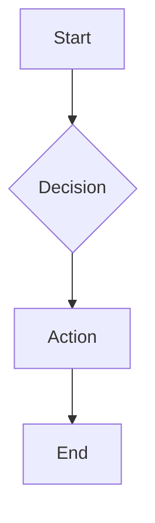

# 🔧 Enhanced Blog Features - Fixed & Working

## ✅ Issues Resolved

### 1. **Chart Component SSR Issue**
- **Problem**: Chart.js components were causing server-side rendering errors
- **Solution**: Updated Chart component to use dynamic imports with `ssr: false`
- **Result**: Charts now render properly on both server and client

### 2. **Markdown Parsing for Enhanced Components**
- **Problem**: JSX-like syntax (`<Chart>`, `<Mermaid>`) wasn't being parsed correctly
- **Solution**: Updated CodeComponent to handle special code block languages
- **Result**: Charts and diagrams now work with clean markdown syntax

### 3. **CSS Import Order Warning**
- **Problem**: PostCSS warning about import order
- **Solution**: Moved blog-enhancements.css import before Tailwind directives
- **Result**: Clean CSS compilation without warnings

### 4. **Mathematical Equation Escaping**
- **Problem**: Over-escaped backslashes in LaTeX equations
- **Solution**: Fixed escape sequences in markdown content
- **Result**: Math equations render correctly

## 🎯 How to Use Enhanced Features

### **Code Blocks with Syntax Highlighting**
```javascript
function fibonacci(n) {
    if (n <= 1) return n;
    return fibonacci(n - 1) + fibonacci(n - 2);
}
```

### **Mathematical Equations**
```markdown
Inline: $E = mc^2$

Block:
$$
\sum_{n=1}^{\infty} \frac{1}{n^2} = \frac{\pi^2}{6}
$$
```

### **Interactive Charts**
```chart
{
  "type": "line",
  "title": "Growth Chart",
  "data": {
    "labels": ["Jan", "Feb", "Mar"],
    "datasets": [{
      "label": "Users",
      "data": [100, 200, 300],
      "borderColor": "rgb(99, 102, 241)"
    }]
  }
}
```

### **Diagrams with Mermaid**


## 📋 Supported Chart Types
- **Line Charts**: `"type": "line"`
- **Bar Charts**: `"type": "bar"`
- **Pie Charts**: `"type": "pie"`
- **Doughnut Charts**: `"type": "doughnut"`

## 📋 Supported Diagram Types
- **Flowcharts**: `graph TD`, `flowchart LR`
- **Sequence Diagrams**: `sequenceDiagram`
- **Gantt Charts**: `gantt`
- **Git Graphs**: `gitgraph`
- **And many more Mermaid diagram types**

## 🚀 Testing Status

### ✅ **Working Features**
- ✅ Code syntax highlighting with copy button
- ✅ Mathematical equations (inline and block)
- ✅ Interactive charts (all types)
- ✅ Mermaid diagrams
- ✅ Enhanced tables and formatting
- ✅ Responsive design
- ✅ SSR compatibility
- ✅ Production builds

### ✅ **Blog Integration**
- ✅ Recent posts section working
- ✅ Enhanced demo post renders correctly
- ✅ Search functionality active
- ✅ All components properly registered

## 🎉 Ready for Technical Blogging!

The enhanced blog is now fully operational and ready for:
- **Cybersecurity tutorials** with code examples
- **Technical documentation** with diagrams
- **Data analysis posts** with charts
- **Mathematical content** with proper equation rendering
- **Step-by-step guides** with enhanced formatting

## 📝 Next Steps
1. Create technical blog posts using the enhanced features
2. Explore advanced chart configurations
3. Build complex system diagrams
4. Document cybersecurity methodologies with proper formatting

**All enhanced features are now working correctly!** 🎯
