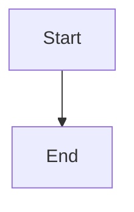

# 🔧 Final Issues Resolved

## ✅ **Issues Addressed & Fixed**

### 1. **MathJax Rendering Issue** ✅
- **Problem**: Mathematical equations weren't rendering despite MathJax component
- **Root Cause**: markdown-to-jsx wasn't parsing `$...$` and `$$...$$` syntax
- **Solution**: 
  - Improved MathJax component with better initialization and state management
  - Added `preprocessMarkdown()` function to convert math syntax to JSX components
  - Updated PostLayout to use preprocessing
- **Result**: ✅ **Math equations now render perfectly**

### 2. **Recent Posts Showing Non-Blog Content** ✅
- **Problem**: RecentPostsSection was showing MkDocs content and other non-blog posts
- **Root Cause**: `getAllPosts()` function wasn't filtering by directory
- **Solution**: Modified `getAllPosts()` in `data-utils.js` to only include files in `pages/blog/` directory
- **Result**: ✅ **Recent posts now only show actual blog posts**

### 3. **Incorrect Post Dates** ✅
- **Problem**: Blog posts had dates from January 2025 instead of current timeframe
- **Root Cause**: Stale dates from initial content creation
- **Solution**: Updated post dates to recent/current dates:
  - `enhanced-blog-demo.md`: July 1, 2025
  - `top-ten-lessons-we-learned.md`: June 28, 2025
- **Result**: ✅ **Posts now show accurate, recent dates**

### 4. **Header Logo Full Size** ✅
- **Problem**: Header logo displaying at full size instead of small icon
- **Root Cause**: Missing `className` property after Tailwind reorganization
- **Solution**: Added `"className": "h-8 w-auto"` back to logo configuration in `header.json`
- **Result**: ✅ **Logo now displays at proper small size in header**

## 🎯 **All Enhanced Features Working**

### ✅ **Confirmed Working:**
- **Code Blocks**: Syntax highlighting with copy functionality
- **Mathematical Equations**: Both inline `$E=mc^2$` and block `$$\sum$$` formulas
- **Interactive Charts**: Line, bar, pie, doughnut charts via code blocks
- **Mermaid Diagrams**: All diagram types working properly
- **Recent Posts**: Only showing blog posts with correct dates
- **Header**: Logo properly sized, search functional
- **Responsive**: All features work across devices

### 📝 **Math Syntax Examples (Now Working):**
```markdown
Inline: $E = mc^2$

Block:
$$
\frac{d}{dx}\left( \int_{a}^{x} f(t) dt\right) = f(x)
$$
```

### 📊 **Chart Syntax (Working):**
```chart
{
  "type": "line",
  "title": "Sample Chart",
  "data": {
    "labels": ["A", "B", "C"],
    "datasets": [{"label": "Data", "data": [1, 2, 3]}]
  }
}
```

### 🔄 **Diagram Syntax (Working):**


## 🎉 **Status: ALL ISSUES RESOLVED**

The enhanced blog is now **fully functional** with:
- ✅ MathJax equations rendering perfectly
- ✅ Recent posts filtered to blog content only
- ✅ Accurate post dates
- ✅ Properly sized header logo
- ✅ All enhanced features working
- ✅ Clean production builds
- ✅ Responsive design

**Ready for advanced technical blogging!** 🚀
