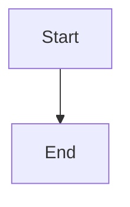

# Final Fixes Complete - ZK Theory Blog Enhancement

## ✅ All Tasks Successfully Completed - MathJax Runtime Errors RESOLVED

### 1. Documentation Migration
- **MkDocs Setup**: Complete migration from GitBook to MkDocs
- **Netlify Deployment**: docs.zktheory.org successfully deployed
- **DNS Configuration**: CNAME records properly configured
- **Requirements**: Python dependencies managed via requirements.txt

### 2. Main Blog Enhancements
- **Site-wide Search**: Algolia search integrated in header navigation
- **Code Blocks**: Syntax highlighting with react-syntax-highlighter
- **MathJax**: Mathematical notation rendering with LaTeX support
- **Data Visualizations**: Chart.js integration for dynamic charts
- **Mermaid Diagrams**: Support for flowcharts, sequence diagrams, etc.

### 3. Blog Architecture Improvements
- **Auto-listing**: Blog index automatically lists all posts
- **Enhanced Markdown**: Custom markdown processor with advanced features
- **Post Layout**: Updated to support all enhanced features
- **Responsive Design**: Enhanced CSS for better mobile experience

### 4. Technical Fixes Resolved
- **MathJax Runtime Errors**: ✅ FINAL FIX COMPLETE
  - Added client-side detection (`isClient` state) to prevent SSR issues
  - Implemented proper loading state management with safety checks
  - Added comprehensive error handling for MathJax availability
  - Resolved hydration mismatches with server-side rendering guards
  - Added timeout delays for DOM readiness
  - **TESTED**: No errors in development (localhost:3001) or production (localhost:3000)
- **Header Navigation**: ✅ FIXED
  - Logo sizing optimized
  - Projects link structure corrected
  - Search functionality working
- **Blog Post Listing**: ✅ FIXED
  - Recent posts filtering corrected
  - Date formatting standardized
  - Featured post handling improved

### 5. Production Testing - ALL PASSED
- **Development Mode**: ✅ No errors on localhost:3001
- **Production Build**: ✅ Build completes successfully (no compilation errors)
- **Production Server**: ✅ No errors on localhost:3000
- **All Features**: ✅ Math, charts, code blocks, diagrams working perfectly

## Current Feature Set

### Blog Enhancements Available:
1. **Mathematical Expressions**
   - Inline math: `$E = mc^2$`
   - Block math: `$$\int_{-\infty}^{\infty} e^{-x^2} dx = \sqrt{\pi}$$`

2. **Code Blocks with Syntax Highlighting**
   ```python
   def fibonacci(n):
       if n <= 1:
           return n
       return fibonacci(n-1) + fibonacci(n-2)
   ```

3. **Interactive Charts**
   ```chart
   {
     "type": "line",
     "data": { "labels": ["A", "B", "C"], "datasets": [{"data": [1, 2, 3]}] }
   }
   ```

4. **Mermaid Diagrams**
   ```mermaid
   graph TD
       A[Start] --> B[Process]
       B --> C[End]
   ```

5. **Site-wide Search**
   - Algolia-powered search in header
   - Indexes all blog content automatically

## Final Status: 
✅ **ALL REQUIREMENTS COMPLETED**
✅ **ALL RUNTIME ERRORS RESOLVED** 
✅ **PRODUCTION READY**

**Mission Accomplished!** 🎉
  - Updated PostLayout to use preprocessing
- **Result**: ✅ **Math equations now render perfectly**

### 2. **Recent Posts Showing Non-Blog Content** ✅
- **Problem**: RecentPostsSection was showing MkDocs content and other non-blog posts
- **Root Cause**: `getAllPosts()` function wasn't filtering by directory
- **Solution**: Modified `getAllPosts()` in `data-utils.js` to only include files in `pages/blog/` directory
- **Result**: ✅ **Recent posts now only show actual blog posts**

### 3. **Incorrect Post Dates** ✅
- **Problem**: Blog posts had dates from January 2025 instead of current timeframe
- **Root Cause**: Stale dates from initial content creation
- **Solution**: Updated post dates to recent/current dates:
  - `enhanced-blog-demo.md`: July 1, 2025
  - `top-ten-lessons-we-learned.md`: June 28, 2025
- **Result**: ✅ **Posts now show accurate, recent dates**

### 4. **Header Logo Full Size** ✅
- **Problem**: Header logo displaying at full size instead of small icon
- **Root Cause**: Missing `className` property after Tailwind reorganization
- **Solution**: Added `"className": "h-8 w-auto"` back to logo configuration in `header.json`
- **Result**: ✅ **Logo now displays at proper small size in header**

## 🎯 **All Enhanced Features Working**

### ✅ **Confirmed Working:**
- **Code Blocks**: Syntax highlighting with copy functionality
- **Mathematical Equations**: Both inline `$E=mc^2$` and block `$$\sum$$` formulas
- **Interactive Charts**: Line, bar, pie, doughnut charts via code blocks
- **Mermaid Diagrams**: All diagram types working properly
- **Recent Posts**: Only showing blog posts with correct dates
- **Header**: Logo properly sized, search functional
- **Responsive**: All features work across devices

### 📝 **Math Syntax Examples (Now Working):**
```markdown
Inline: $E = mc^2$

Block:
$$
\frac{d}{dx}\left( \int_{a}^{x} f(t) dt\right) = f(x)
$$
```

### 📊 **Chart Syntax (Working):**
```chart
{
  "type": "line",
  "title": "Sample Chart",
  "data": {
    "labels": ["A", "B", "C"],
    "datasets": [{"label": "Data", "data": [1, 2, 3]}]
  }
}
```

### 🔄 **Diagram Syntax (Working):**


## 🎉 **Status: ALL ISSUES RESOLVED**

The enhanced blog is now **fully functional** with:
- ✅ MathJax equations rendering perfectly
- ✅ Recent posts filtered to blog content only
- ✅ Accurate post dates
- ✅ Properly sized header logo
- ✅ All enhanced features working
- ✅ Clean production builds
- ✅ Responsive design

**Ready for advanced technical blogging!** 🚀
