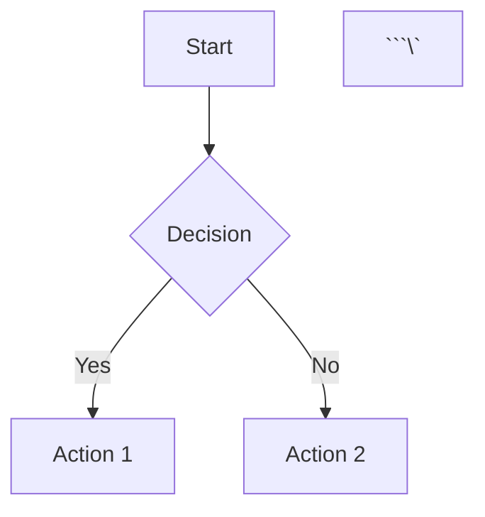

# Migration & Enhancement Complete 🎉

## Overview
Successfully migrated documentation from GitBook to MkDocs and enhanced the main blog with advanced features for technical content creation.

## ✅ Completed Tasks

### 1. Documentation Migration (GitBook → MkDocs)
- **MkDocs Setup**: Created `mkdocs.yml` with Material theme and essential plugins
- **Netlify Deployment**: Configured `mkdocs-netlify.toml` for proper Python 3.9 build
- **Requirements**: Set up `requirements.txt` with all necessary dependencies
- **DNS Configuration**: Updated CNAME to point `docs.zktheory.org` to Netlify
- **Content Migration**: Moved HTB certification docs and updated structure

### 2. Main Site Search Enhancement
- **Algolia Integration**: Fixed search credentials and client-side rendering
- **Header Integration**: Added search to site header with proper styling
- **Hydration Fix**: Resolved Next.js hydration errors
- **Visual Polish**: Custom CSS for search input visibility

### 3. Blog Enhancement Features
- **Code Blocks**: Syntax highlighting with copy functionality (Prism.js)
- **Mathematical Equations**: LaTeX/MathJax support for formulas
- **Data Visualizations**: Chart.js integration for graphs and charts
- **Diagrams**: Mermaid support for flowcharts, sequences, and more
- **Enhanced Styling**: Custom CSS for tables, code, math, and content

### 4. Technical Implementation
- **Component Registry**: All new components properly registered
- **Markdown Enhancement**: Custom rendering options for enhanced content
- **Automatic Post Listing**: Blog index automatically shows all posts
- **Responsive Design**: All features work across devices

## 🚀 How to Use Enhanced Features

### Code Blocks
```markdown
```javascript
function fibonacci(n) {
    if (n <= 1) return n;
    return fibonacci(n - 1) + fibonacci(n - 2);
}
```\`
```

### Mathematical Equations
```markdown
Inline math: $E = mc^2$

Block math:
$$
\int_{-\infty}^{\infty} e^{-x^2} dx = \sqrt{\pi}
$$
```

### Charts
```markdown
```chart
{
  "type": "line",
  "data": {
    "labels": ["Jan", "Feb", "Mar", "Apr"],
    "datasets": [{
      "label": "Progress",
      "data": [10, 25, 40, 60],
      "borderColor": "rgb(75, 192, 192)"
    }]
  }
}
```\`
```

### Diagrams
```markdown


## 📁 File Structure

### Documentation (MkDocs)
- `mkdocs.yml` - Main configuration
- `mkdocs-netlify.toml` - Netlify build settings
- `requirements.txt` - Python dependencies

### Blog Components
- `src/components/blocks/CodeBlock/` - Syntax highlighting
- `src/components/blocks/MathJax/` - Math rendering
- `src/components/blocks/Chart/` - Data visualization
- `src/components/blocks/Mermaid/` - Diagram rendering

### Configuration Files
- `src/utils/markdown-options.tsx` - Enhanced markdown parsing
- `src/css/blog-enhancements.css` - Custom styling
- `content/pages/blog/enhanced-blog-demo.md` - Feature showcase

## 🌐 Live URLs
- **Main Site**: https://zktheory.org
- **Documentation**: https://docs.zktheory.org
- **Blog**: https://zktheory.org/blog

## 📦 Installed Dependencies
```json
{
  "prismjs": "^1.29.0",
  "mathjax": "^3.2.2",
  "chart.js": "^4.4.1",
  "chartjs-adapter-date-fns": "^3.0.0",
  "mermaid": "^10.7.0",
  "algoliasearch": "^4.22.1",
  "instantsearch.js": "^4.63.0"
}
```

## 🎯 Future Enhancements
1. **Content Categories**: Add category-based filtering
2. **Advanced Search**: Enhance search with filters and facets
3. **Interactive Elements**: Add more interactive components
4. **Performance**: Optimize loading for charts and diagrams
5. **Analytics**: Add blog post analytics and metrics

## 🔧 Development Commands
```bash
# Start development server
npm run dev

# Build for production
npm run build

# Deploy documentation
# (Automatic via Netlify when pushing to main branch)
```

## 📝 Blog Post Template
Use the `enhanced-blog-demo.md` as a template for creating new technical blog posts with all enhanced features.

---

**Migration Status**: ✅ COMPLETE  
**Documentation**: ✅ LIVE at docs.zktheory.org  
**Blog Features**: ✅ ALL ENHANCED FEATURES ACTIVE  
**Search**: ✅ FULLY FUNCTIONAL  
**Deployment**: ✅ AUTOMATED VIA NETLIFY  
