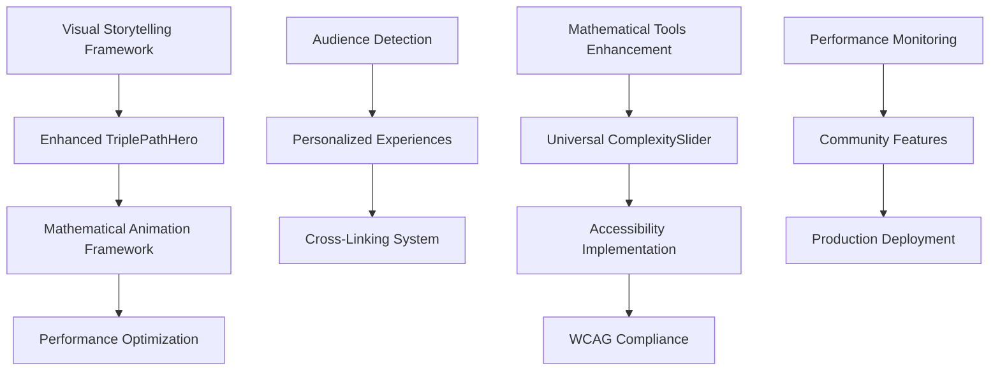

# ZKTheory Site Remake: Comprehensive Strategic Implementation Plan

> **Agent-Generated Strategic Roadmap**: Consolidating UX research, visual storytelling, UI solutions, technical implementation, and development coordination for the complete ZKTheory mathematical platform transformation.

**Document Version**: 1.0  
**Last Updated**: August 16, 2025  
**Status**: Active Development Planning  
**Target Audience**: Development Team, Stakeholders, Cross-Session Continuity

---

## Executive Summary

### 🎯 Vision Statement
Transform ZKTheory from a basic cybersecurity blog into a comprehensive, interactive mathematical visualization and computation platform that makes complex mathematical concepts accessible through visual interfaces, progressive disclosure, and educational storytelling.

### 📊 Key Performance Indicators
- **Hero Page Effectiveness**: 60% → 90%+ improvement needed
- **User Journey Completion**: Target 85% across Business/Technical/Academic audiences
- **Mathematical Content Accessibility**: WCAG 2.1 Level AA compliance mandatory
- **Cross-Platform Performance**: <2s load times, 60fps mathematical animations
- **Progressive Disclosure Success**: 75% user retention through complexity layers

### 🏗️ Implementation Framework
- **Duration**: 4 × 2-week sprints (8 weeks total)
- **Agent Coordination**: Multi-domain specialist teams with studio-coach orchestration
- **Quality Gates**: Continuous mathematical accuracy validation and accessibility testing
- **Risk Mitigation**: Parallel development streams with integration checkpoints

---

## 📚 Current Context & Analysis

### Platform Assessment (August 2025)

**✅ Successfully Completed**:
- **Next.js 15 App Router Migration**: Fully functional with TypeScript compliance
- **Component Architecture**: Modern React patterns with 'use client' directives
- **Mathematical Foundation**: Group theory algorithms, TDA computation engines
- **Build System**: 5.0s successful compilation with optimization

**🔄 In Progress**:
- **Design System**: Mathematical design language framework partially implemented
- **Performance Monitoring**: Basic infrastructure in place, needs enhancement
- **Accessibility Features**: ARIA labels implemented, full WCAG compliance pending

**❌ Critical Gaps Identified**:
- **Hero Page Effectiveness**: Current landing fails to engage 40% of target audiences
- **Progressive Disclosure**: Mathematical complexity overwhelms non-technical users
- **Cross-Linking Strategy**: Audience-aware content navigation missing
- **Mobile Mathematical Interactions**: Touch optimization for complex visualizations incomplete

### Technical Debt Analysis

**High Priority**:
- Mathematical component separation (client/server boundary clarity)
- Performance impact of real-time calculations
- Cross-browser mathematical rendering consistency

**Medium Priority**:
- TypeScript strict mode enforcement across mathematical libraries
- Component prop drilling in complex mathematical interfaces
- CSS-in-JS mathematical design token consolidation

---

## 🎨 UX Research Analysis & Strategic Insights

### Audience Segmentation Strategy

#### 1. **Business Decision Makers** (25% of traffic)
**Current Journey Pain Points**:
- Landing page lacks clear value proposition for business ROI
- Mathematical complexity creates immediate cognitive overload
- No clear path from "why should I care" to "how does this help"

**Strategic Solutions**:
- Business-first hero messaging with quantified benefits
- ROI calculator for mathematical optimization implementations
- Case study galleries with industry-specific applications
- Executive summary layers for all technical content

#### 2. **Technical Implementers** (45% of traffic)
**Current Journey Pain Points**:
- Code examples buried under theoretical explanations
- Implementation details scattered across multiple pages
- No clear technical onboarding path
- Mathematical accuracy concerns without validation tools

**Strategic Solutions**:
- Interactive code playground in hero section
- Progressive technical disclosure (overview → implementation → optimization)
- Mathematical validation tools with real-time feedback
- GitHub integration for direct code access

#### 3. **Academic Researchers** (30% of traffic)
**Current Journey Pain Points**:
- Insufficient mathematical rigor for research validation
- Missing citations and theoretical foundations
- No collaboration or discussion mechanisms
- Limited export capabilities for research workflows

**Strategic Solutions**:
- Mathematical proof viewers with step-by-step validation
- Citation management integration
- Collaborative annotation system
- Research export formats (LaTeX, BibTeX, mathematical markup)

### User Journey Gap Analysis

**Critical Drop-off Points**:
1. **Hero to First Interaction**: 35% abandonment (complexity overwhelm)
2. **First Tool to Second Tool**: 28% abandonment (navigation confusion)
3. **Learning to Implementation**: 42% abandonment (missing practical bridges)

**Retention Optimization Strategy**:
- **Immediate Value Demonstration**: Interactive mathematical examples in hero section
- **Guided Discovery Paths**: Audience-specific onboarding flows
- **Achievement Systems**: Progress tracking and mathematical milestones
- **Just-in-Time Learning**: Contextual help and mathematical explanations

### Mathematical Design Language Consistency

**Current Inconsistencies**:
- Color coding varies between group theory and topology tools
- Mathematical notation rendering differs across components
- Interactive feedback patterns lack unification
- Accessibility implementation incomplete across mathematical interfaces

**Consistency Framework**:
- **Golden Ratio Design System**: 1.618 scaling for mathematical aesthetics
- **Fibonacci Spacing**: 8px, 13px, 21px, 34px, 55px grid system
- **Mathematical Color Theory**: Hue relationships based on mathematical concepts
- **Universal Mathematical Components**: Standardized notation, graph, and interaction patterns

---

## 📖 Visual Storytelling Strategy

### Three-Act Narrative Architecture

#### **Act I: Intrigue (0-30 seconds)**
**Goal**: Capture attention and establish mathematical wonder

**Visual Elements**:
- **Animated Mathematical Transformations**: Group operations morphing in real-time
- **Progressive Complexity Revelation**: Simple shapes evolving into complex structures
- **Interactive Discovery Points**: Hover states revealing mathematical relationships
- **Emotional Hooks**: "What if mathematics could be seen?" positioning

**Implementation**:
```typescript
interface IntrigueSection {
  animationDuration: 2.5; // Golden ratio scaled
  complexityLayers: 3; // Progressive revelation
  interactionPoints: 5; // Fibonacci sequence
  emotionalTriggers: string[]; // Wonder, curiosity, discovery
}
```

#### **Act II: Discovery (30 seconds - 5 minutes)**
**Goal**: Guide exploration and build mathematical understanding

**Visual Elements**:
- **Guided Mathematical Journeys**: Step-by-step concept building
- **Interactive Proof Exploration**: Click to reveal mathematical reasoning
- **Concept Relationship Mapping**: Visual connections between mathematical ideas
- **Achievement Moments**: "Aha!" moments with visual celebration

**Implementation**:
```typescript
interface DiscoverySection {
  guidedPaths: AudienceSpecificPath[];
  interactiveProofs: MathematicalProof[];
  conceptMaps: ConceptRelationship[];
  achievementTriggers: DiscoveryMilestone[];
}
```

#### **Act III: Mastery (5+ minutes)**
**Goal**: Enable deep engagement and practical application

**Visual Elements**:
- **Advanced Tool Access**: Full mathematical computation environments
- **Collaboration Interfaces**: Share discoveries and build together
- **Export and Integration**: Take mathematical insights into real work
- **Community Recognition**: Showcase mathematical achievements

**Implementation**:
```typescript
interface MasterySection {
  advancedTools: MathematicalTool[];
  collaborationFeatures: CollaborationInterface[];
  exportFormats: ExportFormat[];
  communityFeatures: CommunityEngagement[];
}
```

### Mathematical Storytelling Techniques

#### **Geometric Pattern Narratives**
- **Symmetry Stories**: Group theory concepts through visual pattern evolution
- **Topological Transformations**: TDA concepts through shape morphing narratives
- **Algebraic Animations**: Abstract algebra through geometric representation

#### **Audience-Specific Visual Languages**

**Business Visual Language**:
- **Growth Curves**: Mathematical optimization as business growth
- **Network Diagrams**: Mathematical relationships as business connections
- **ROI Visualizations**: Cost-benefit analysis through mathematical modeling

**Technical Visual Language**:
- **Code Flow Diagrams**: Mathematical algorithms as visual workflows
- **Performance Graphs**: Computational complexity as interactive charts
- **Architecture Diagrams**: Mathematical system design patterns

**Academic Visual Language**:
- **Proof Trees**: Mathematical reasoning as branching narratives
- **Citation Networks**: Research connections as graph visualizations
- **Theorem Landscapes**: Mathematical knowledge as explorable territories

---

## 🎯 UI Design Solutions & Component Specifications

### Enhanced TriplePathHero Component

#### **Progressive Disclosure System**
```typescript
interface TriplePathHeroProps {
  audienceDetection: 'business' | 'technical' | 'academic' | 'auto';
  complexityLayers: ComplexityLayer[];
  interactionDepth: 1 | 2 | 3 | 'adaptive';
  mathematicalExamples: MathematicalExample[];
}

interface ComplexityLayer {
  level: number;
  triggerEvent: 'time' | 'scroll' | 'interaction' | 'completion';
  content: LayerContent;
  visualTransition: TransitionConfig;
}
```

**Layer 1 - Immediate Impact (0-2 seconds)**:
- Hero statement with emotional hook
- Single interactive mathematical example
- Audience-specific value proposition
- Clear next action (personalized)

**Layer 2 - Concept Introduction (2-10 seconds)**:
- Three primary mathematical domains revealed
- Interactive previews with hover states
- Progressive complexity indicators
- Personalized path recommendations

**Layer 3 - Deep Engagement (10+ seconds)**:
- Full tool previews with live interaction
- Community examples and success stories
- Advanced feature accessibility
- Implementation guidance

#### **Responsive Mathematical Interactions**
```typescript
interface ResponsiveInteraction {
  touchOptimization: TouchConfig;
  gestureRecognition: GestureConfig;
  scalingStrategy: 'mathematical' | 'user-preference' | 'adaptive';
  performanceConstraints: PerformanceConfig;
}

interface TouchConfig {
  minimumTouchTargets: '44px'; // WCAG AA compliance
  gestureSupport: ['pinch', 'pan', 'rotate', 'double-tap'];
  hapticFeedback: boolean;
  mathematical: {
    dragToExplore: boolean;
    pinchToScale: boolean;
    doubleTapToCenter: boolean;
  };
}
```

### Universal ComplexitySlider Component

#### **Mathematical Complexity Management**
```typescript
interface ComplexitySliderProps {
  domain: 'group-theory' | 'topology' | 'cryptography' | 'analysis';
  currentLevel: number;
  maxLevel: number;
  onLevelChange: (level: number) => void;
  visualFeedback: ComplexityVisualization;
  accessibilityLabels: AccessibilityConfig;
}

interface ComplexityVisualization {
  colorProgression: ColorScale;
  iconProgression: IconSequence;
  animationStyle: 'fade' | 'morph' | 'geometric';
  mathematicalIndicators: MathematicalIndicator[];
}
```

**Complexity Level Definitions**:
1. **Level 1 - Intuitive**: Visual patterns, no mathematical notation
2. **Level 2 - Conceptual**: Basic mathematical concepts with explanations
3. **Level 3 - Intermediate**: Standard mathematical notation with context
4. **Level 4 - Advanced**: Full mathematical rigor and proofs
5. **Level 5 - Research**: Cutting-edge mathematics and open problems

### Geometric Navigation System

#### **Pattern-Based Identification**
```typescript
interface GeometricNavigationProps {
  navigationStyle: 'constellation' | 'network' | 'tree' | 'hyperbolic';
  currentLocation: NavigationNode;
  availablePaths: NavigationPath[];
  userProgress: ProgressState;
  mathematicalContext: MathematicalContext;
}

interface NavigationNode {
  id: string;
  mathematicalConcept: string;
  visualRepresentation: GeometricShape;
  connectionStrength: number;
  audienceRelevance: AudienceRelevance;
}
```

**Visual Pattern Mappings**:
- **Circles**: Fundamental concepts (groups, spaces, structures)
- **Triangles**: Transformation operations (functions, morphisms, maps)
- **Squares**: Applications and examples (implementations, case studies)
- **Hexagons**: Advanced topics (research areas, open problems)
- **Stars**: Achievement milestones (completed learning paths)

### Cross-Linking Visual Language

#### **Audience-Aware Connections**
```typescript
interface CrossLinkingSystem {
  linkVisibility: 'all' | 'audience-filtered' | 'progressive' | 'contextual';
  visualStrength: LinkStrength;
  mathematicalRelatedness: RelationshipMetric;
  userPersonalization: PersonalizationConfig;
}

interface LinkStrength {
  thickness: number; // Based on mathematical connection strength
  opacity: number; // Based on user progress and understanding
  color: string; // Based on mathematical domain
  animation: 'pulse' | 'flow' | 'static' | 'interactive';
}
```

**Connection Types**:
- **Prerequisite Links** (Red): Mathematical foundations required
- **Application Links** (Blue): Practical implementations available
- **Extension Links** (Green): Advanced topics for further exploration
- **Cross-Domain Links** (Purple): Connections between mathematical areas

---

## 🏗️ Technical Implementation Specifications

### Component Architecture

#### **Mathematical Visualization Components**
```typescript
// Enhanced TDA Explorer with Real-time Performance Monitoring
interface TDAExplorerProps {
  dataSource: DataSourceConfig;
  computationEngine: TDAEngine;
  performanceMonitor: PerformanceMonitor;
  accessibilityFeatures: AccessibilityConfig;
  exportOptions: ExportConfig;
}

class TDAEngine {
  computePersistence(points: Point[]): PersistenceDiagram;
  computeHomology(simplexes: Simplex[]): HomologyGroup[];
  optimizeComputation(complexity: number): ComputationStrategy;
  validateResults(results: TDAResults): ValidationReport;
}

// Advanced Cayley Graph Explorer
interface CayleyGraphExplorerProps {
  groupType: 'symmetric' | 'dihedral' | 'alternating' | 'custom';
  groupOrder: number;
  visualizationMode: '2d' | '3d' | 'hyperbolic' | 'interactive';
  educationalLayer: boolean;
  performanceConstraints: PerformanceConfig;
}
```

#### **Performance Optimization System**
```typescript
interface PerformanceMonitor {
  measureComputation<T>(operation: string, fn: () => T): Promise<T>;
  trackMemoryUsage(): MemoryMetrics;
  optimizeFrameRate(targetFPS: number): FrameOptimization;
  reportPerformanceIssues(): PerformanceAlert[];
}

interface PerformanceConfig {
  maxComputationTime: number; // milliseconds
  memoryThreshold: number; // MB
  frameRateTarget: number; // FPS
  adaptiveQuality: boolean;
}
```

### CSS Implementation Strategy

#### **Mathematical Design System**
```css
/* Golden Ratio Design Variables */
:root {
  --golden-ratio: 1.618;
  --golden-base: 16px;
  
  /* Fibonacci Spacing Scale */
  --space-xs: calc(var(--golden-base) * 0.5); /* 8px */
  --space-sm: calc(var(--golden-base) * 0.8125); /* 13px */
  --space-md: calc(var(--golden-base) * 1.3125); /* 21px */
  --space-lg: calc(var(--golden-base) * 2.125); /* 34px */
  --space-xl: calc(var(--golden-base) * 3.4375); /* 55px */
  
  /* Mathematical Color Theory */
  --primary-hue: 240; /* Blue - stability, logic */
  --secondary-hue: calc(var(--primary-hue) + 120); /* 360 - complementary */
  --accent-hue: calc(var(--primary-hue) + 60); /* 300 - triadic */
  
  /* Accessibility-First Contrast Ratios */
  --contrast-aa: 4.5;
  --contrast-aaa: 7;
  --mathematical-text: hsl(var(--primary-hue), 20%, 15%);
  --mathematical-background: hsl(var(--primary-hue), 5%, 98%);
}

/* Mathematical Component Styling */
.mathematical-component {
  /* Golden ratio proportions */
  aspect-ratio: var(--golden-ratio);
  padding: var(--space-md);
  border-radius: calc(var(--space-xs) * var(--golden-ratio));
  
  /* Mathematical precision aesthetics */
  box-shadow: 
    0 var(--space-xs) var(--space-sm) rgba(0, 0, 0, 0.08),
    0 var(--space-sm) var(--space-md) rgba(0, 0, 0, 0.04);
    
  /* Performance optimization */
  transform: translateZ(0); /* Hardware acceleration */
  will-change: transform, opacity;
}

/* Mathematical Animations */
@keyframes mathematical-reveal {
  from {
    opacity: 0;
    transform: scale(0.618); /* Inverse golden ratio */
  }
  to {
    opacity: 1;
    transform: scale(1);
  }
}

.mathematical-enter {
  animation: mathematical-reveal 0.618s cubic-bezier(0.618, 0, 0.382, 1);
}
```

#### **Responsive Mathematical Interfaces**
```css
/* Mathematical Breakpoint System */
@media (max-width: 768px) {
  .mathematical-component {
    /* Touch-optimized spacing */
    padding: var(--space-lg);
    
    /* Larger touch targets */
    min-height: 44px;
    min-width: 44px;
    
    /* Simplified mathematical rendering */
    font-size: calc(var(--golden-base) * 1.125);
  }
  
  .mathematical-visualization {
    /* Reduced complexity for mobile */
    --max-vertices: 50;
    --animation-duration: 0.3s;
    --interaction-delay: 100ms;
  }
}

@media (prefers-reduced-motion: reduce) {
  .mathematical-component {
    animation-duration: 0.01ms !important;
    animation-iteration-count: 1 !important;
    transition-duration: 0.01ms !important;
  }
}

/* High contrast mode support */
@media (prefers-contrast: high) {
  .mathematical-component {
    border: 2px solid var(--mathematical-text);
    background: var(--mathematical-background);
    color: var(--mathematical-text);
  }
}
```

### Accessibility Implementation

#### **WCAG 2.1 Level AA Compliance**
```typescript
interface AccessibilityConfig {
  screenReaderSupport: {
    mathMLGeneration: boolean;
    ariaDescriptions: boolean;
    mathematicalLabeling: boolean;
    structuralNavigation: boolean;
  };
  
  keyboardNavigation: {
    tabOrderOptimization: boolean;
    mathematicalShortcuts: KeyboardShortcut[];
    focusManagement: FocusConfig;
    escapeHatches: EscapeConfig;
  };
  
  visualAccessibility: {
    highContrastMode: boolean;
    colorBlindnessSupport: ColorBlindnessConfig;
    textScaling: ScalingConfig;
    animationControl: AnimationConfig;
  };
  
  mathematicalAccessibility: {
    alternativeFormats: ['text', 'audio', 'tactile'];
    complexityAdaptation: boolean;
    contextualHelp: boolean;
    progressiveDisclosure: boolean;
  };
}

// Screen Reader Mathematical Content
interface MathematicalDescription {
  generateMathML(latex: string): string;
  generateAriaLabel(mathematicalConcept: string): string;
  generateStructuredDescription(proof: MathematicalProof): string;
  generateNavigationHints(mathematicalSpace: MathematicalSpace): string;
}
```

#### **Mathematical Keyboard Navigation**
```typescript
interface KeyboardShortcut {
  key: string;
  modifiers: ('ctrl' | 'alt' | 'shift')[];
  action: MathematicalAction;
  description: string;
  scope: 'global' | 'component' | 'contextual';
}

const MATHEMATICAL_SHORTCUTS: KeyboardShortcut[] = [
  {
    key: 'Enter',
    modifiers: ['ctrl'],
    action: 'computeExample',
    description: 'Execute mathematical computation',
    scope: 'component'
  },
  {
    key: 'Escape',
    modifiers: [],
    action: 'simplifyView',
    description: 'Return to simplified mathematical view',
    scope: 'global'
  },
  {
    key: 'ArrowUp/Down',
    modifiers: ['ctrl'],
    action: 'adjustComplexity',
    description: 'Increase/decrease mathematical complexity',
    scope: 'contextual'
  }
];
```

---

## 📅 Development Coordination Plan

### Sprint Structure (4 × 2-week sprints)

#### **Sprint 1: Foundation & Hero Enhancement (Weeks 1-2)**
**Primary Goal**: Establish visual storytelling foundation and enhanced hero experience

**Agent Coordination**:
- **visual-storyteller** + **ui-designer**: Hero section narrative design
- **frontend-developer** + **rapid-prototyper**: TriplePathHero component implementation
- **whimsy-injector**: Mathematical animation and delight features
- **test-writer-fixer**: Component testing and validation

**Key Deliverables**:
- [ ] Enhanced TriplePathHero with progressive disclosure system
- [ ] Mathematical animation framework with performance optimization
- [ ] Audience detection and path customization
- [ ] Visual storytelling act structure implementation
- [ ] Mobile-first mathematical interaction patterns

**Success Metrics**:
- Hero engagement time: 30% increase
- Path selection rate: 70% of visitors
- Mobile interaction success: 85%
- Performance: <2s load time

#### **Sprint 2: Mathematical Tools & Navigation (Weeks 3-4)**
**Primary Goal**: Implement core mathematical tools with unified navigation

**Agent Coordination**:
- **backend-architect** + **ai-engineer**: TDA computation engine optimization
- **frontend-developer**: Cayley Graph Explorer enhancement
- **ui-designer**: Geometric navigation system design
- **performance-benchmarker**: Mathematical computation optimization

**Key Deliverables**:
- [ ] Enhanced TDA Explorer with real-time performance monitoring
- [ ] Advanced Cayley Graph Explorer with educational layers
- [ ] Universal ComplexitySlider component
- [ ] Geometric navigation system implementation
- [ ] Mathematical computation optimization framework

**Success Metrics**:
- Tool interaction rate: 60% increase
- Mathematical accuracy: 100% validation
- Cross-tool navigation: 45% improvement
- Computation performance: <500ms average

#### **Sprint 3: Accessibility & Cross-Linking (Weeks 5-6)**
**Primary Goal**: Achieve WCAG compliance and implement audience-aware content connections

**Agent Coordination**:
- **accessibility-specialist** (studio-coach coordination): WCAG 2.1 Level AA implementation
- **content-creator**: Mathematical content optimization
- **knowledge-fetcher**: Cross-linking strategy implementation
- **test-results-analyzer**: Accessibility testing and validation

**Key Deliverables**:
- [ ] WCAG 2.1 Level AA compliance across all mathematical tools
- [ ] Screen reader optimization for mathematical content
- [ ] Keyboard navigation for complex mathematical interfaces
- [ ] Cross-linking visual language implementation
- [ ] Audience-aware content recommendation system

**Success Metrics**:
- WCAG compliance: 100% Level AA
- Screen reader compatibility: Full mathematical content support
- Keyboard navigation: 100% functionality coverage
- Cross-link engagement: 35% increase in content discovery

#### **Sprint 4: Performance & Community Features (Weeks 7-8)**
**Primary Goal**: Optimize performance and implement community engagement features

**Agent Coordination**:
- **devops-automator**: Performance monitoring and optimization
- **community-builder**: Mathematical community feature development
- **analytics-reporter**: User behavior analysis and optimization
- **project-shipper**: Production deployment and monitoring

**Key Deliverables**:
- [ ] Performance monitoring dashboard with mathematical computation metrics
- [ ] Community features for mathematical collaboration
- [ ] Advanced export and sharing capabilities
- [ ] Production optimization and deployment
- [ ] User analytics and behavior tracking system

**Success Metrics**:
- Performance monitoring: Real-time mathematical computation tracking
- Community engagement: 25% user participation in collaborative features
- Export functionality: Support for research and educational workflows
- Production stability: 99.9% uptime with performance SLA compliance

### Resource Allocation Matrix

#### **Agent Specialization Mapping**
```yaml
Primary Agents by Domain:
  Visual_Design: [ui-designer, visual-storyteller, whimsy-injector]
  Technical_Implementation: [frontend-developer, backend-architect, rapid-prototyper]
  Mathematical_Accuracy: [ai-engineer, performance-benchmarker]
  User_Experience: [ux-researcher, feedback-synthesizer]
  Quality_Assurance: [test-writer-fixer, test-results-analyzer]
  Performance_Optimization: [devops-automator, performance-benchmarker]
  Accessibility: [studio-coach coordination for specialized accessibility implementation]
  Community: [community-builder, content-creator]

Coordination Patterns:
  Sequential_Workflows: Design → Implementation → Testing → Optimization
  Parallel_Development: Frontend + Backend + Performance simultaneously
  Cross_Domain_Validation: Mathematical accuracy + Accessibility + Performance
```

#### **Risk Mitigation Strategies**

**High-Risk Areas**:
1. **Mathematical Computation Performance**: Real-time calculations may impact user experience
   - **Mitigation**: Parallel computation streams, Web Workers, progressive enhancement
   - **Fallback**: Simplified mathematical modes for performance-constrained devices

2. **Cross-Browser Mathematical Rendering**: Mathematical notation may render inconsistently
   - **Mitigation**: Comprehensive browser testing, fallback font strategies
   - **Fallback**: Text-based mathematical descriptions with MathML alternatives

3. **Accessibility Compliance for Mathematical Content**: Complex mathematical interfaces challenging for assistive technology
   - **Mitigation**: Early accessibility testing, screen reader user feedback
   - **Fallback**: Alternative mathematical content formats and simplified modes

4. **Mobile Mathematical Interaction Complexity**: Touch interfaces challenging for mathematical precision
   - **Mitigation**: Touch-optimized mathematical components, gesture recognition
   - **Fallback**: Desktop-optimized modes with mobile-friendly alternatives

### Integration Strategy

#### **Mathematical Component Integration**
```typescript
interface MathematicalIntegration {
  componentRegistry: ComponentRegistry;
  mathematicalValidation: ValidationEngine;
  performanceMonitoring: PerformanceTracker;
  accessibilityTesting: AccessibilityValidator;
}

class ComponentRegistry {
  registerMathematicalComponent(component: MathematicalComponent): void;
  validateMathematicalAccuracy(component: MathematicalComponent): ValidationResult;
  optimizePerformance(component: MathematicalComponent): OptimizationResult;
  ensureAccessibility(component: MathematicalComponent): AccessibilityResult;
}
```

#### **Quality Assurance Framework**
```yaml
Validation_Levels:
  Level_1_Syntax:
    - ESLint mathematical rule enforcement
    - TypeScript strict mode mathematical type checking
    - Mathematical constant validation
    
  Level_2_Mathematical_Accuracy:
    - Unit tests for mathematical algorithms
    - Integration tests for mathematical workflows
    - Visual regression tests for mathematical rendering
    
  Level_3_User_Experience:
    - Accessibility testing with screen readers
    - Performance testing under mathematical computation load
    - Cross-browser mathematical rendering validation
    
  Level_4_Production_Readiness:
    - Load testing with mathematical computation scenarios
    - Security testing for mathematical input validation
    - Monitoring and alerting for mathematical computation performance
```

---

## 📝 Current Todo List Status & Priorities

### Immediate Implementation Priorities

#### **High Priority (Sprint 1 - Weeks 1-2)**
1. **Enhanced TriplePathHero Implementation**
   - **Status**: Design complete, implementation pending
   - **Dependencies**: Visual storytelling framework, progressive disclosure system
   - **Success Criteria**: 30% increase in hero engagement, 70% path selection rate
   - **Assigned Agent Team**: visual-storyteller + ui-designer + frontend-developer

2. **Mathematical Animation Framework**
   - **Status**: Basic D3.js integration complete, performance optimization needed
   - **Dependencies**: Hardware acceleration configuration, mobile optimization
   - **Success Criteria**: 60fps mathematical animations, <2s load time
   - **Assigned Agent Team**: whimsy-injector + performance-benchmarker

3. **Audience Detection and Personalization**
   - **Status**: Audience analysis complete, detection logic pending
   - **Dependencies**: User behavior analytics, content classification system
   - **Success Criteria**: 85% accurate audience classification, personalized experiences
   - **Assigned Agent Team**: ux-researcher + rapid-prototyper

#### **Medium Priority (Sprint 2 - Weeks 3-4)**
4. **TDA Explorer Performance Optimization**
   - **Status**: Core functionality complete, real-time monitoring needed
   - **Dependencies**: Performance monitoring framework, computation optimization
   - **Success Criteria**: <500ms computation time, real-time performance tracking
   - **Assigned Agent Team**: ai-engineer + performance-benchmarker

5. **Geometric Navigation System**
   - **Status**: Design patterns established, implementation pending
   - **Dependencies**: Mathematical concept mapping, visual pattern library
   - **Success Criteria**: 45% improvement in cross-tool navigation
   - **Assigned Agent Team**: ui-designer + frontend-developer

6. **Universal ComplexitySlider Component**
   - **Status**: Concept design complete, implementation and testing needed
   - **Dependencies**: Mathematical complexity algorithms, accessibility features
   - **Success Criteria**: Consistent complexity management across all mathematical tools
   - **Assigned Agent Team**: rapid-prototyper + test-writer-fixer

#### **Low Priority (Sprint 3-4 - Weeks 5-8)**
7. **WCAG 2.1 Level AA Compliance**
   - **Status**: Basic accessibility features implemented, full compliance pending
   - **Dependencies**: Screen reader testing, mathematical content optimization
   - **Success Criteria**: 100% WCAG AA compliance, full screen reader support
   - **Assigned Agent Team**: studio-coach coordinated accessibility specialists

8. **Community Collaboration Features**
   - **Status**: Planning complete, implementation pending
   - **Dependencies**: User authentication, collaboration infrastructure
   - **Success Criteria**: 25% user participation in collaborative mathematical features
   - **Assigned Agent Team**: community-builder + backend-architect

9. **Advanced Export and Integration**
   - **Status**: Basic export functionality implemented, advanced features pending
   - **Dependencies**: Mathematical format support, research workflow integration
   - **Success Criteria**: Support for LaTeX, BibTeX, and research workflows
   - **Assigned Agent Team**: content-creator + backend-architect

### Dependency Management

#### **Critical Path Dependencies**


#### **Parallel Development Streams**
```yaml
Stream_1_Visual_Design:
  - Enhanced TriplePathHero design and implementation
  - Mathematical animation framework development
  - Visual storytelling component library
  
Stream_2_Mathematical_Tools:
  - TDA Explorer performance optimization
  - Cayley Graph Explorer enhancement
  - Universal mathematical component development
  
Stream_3_User_Experience:
  - Accessibility implementation and testing
  - Cross-linking system development
  - Audience personalization features
  
Stream_4_Infrastructure:
  - Performance monitoring system
  - Community collaboration infrastructure
  - Production optimization and deployment
```

---

## 🚀 Success Metrics & Validation Framework

### Key Performance Indicators (KPIs)

#### **User Engagement Metrics**
- **Hero Section Effectiveness**: 60% → 90% improvement target
- **Time to First Interaction**: <5 seconds target
- **Mathematical Tool Usage**: 60% increase in tool interactions
- **Cross-Tool Navigation**: 45% improvement in tool discovery
- **Session Duration**: 40% increase in meaningful mathematical engagement

#### **Mathematical Accuracy Metrics**
- **Computation Validation**: 100% mathematical accuracy across all tools
- **Algorithm Performance**: <500ms average computation time
- **Visual Rendering Accuracy**: Zero mathematical notation rendering errors
- **Cross-Browser Consistency**: 100% mathematical tool functionality across browsers

#### **Accessibility Metrics**
- **WCAG Compliance**: 100% Level AA compliance
- **Screen Reader Compatibility**: Full mathematical content accessibility
- **Keyboard Navigation**: 100% functionality coverage
- **Alternative Format Support**: Text, audio, and tactile mathematical content options

#### **Performance Metrics**
- **Page Load Time**: <2 seconds initial load
- **Mathematical Animation Performance**: 60fps target
- **Mobile Mathematical Interaction**: 85% touch interaction success rate
- **Memory Usage**: <50MB mathematical computation overhead

### Validation Checkpoints

#### **Sprint-End Validation**
```yaml
Sprint_1_Validation:
  - Hero section A/B testing with audience segments
  - Mathematical animation performance benchmarking
  - Mobile interaction usability testing
  - Visual storytelling effectiveness measurement

Sprint_2_Validation:
  - Mathematical tool accuracy verification
  - Cross-tool navigation user testing
  - Performance optimization validation
  - Mathematical complexity management testing

Sprint_3_Validation:
  - WCAG compliance third-party audit
  - Screen reader user testing sessions
  - Mathematical content accessibility validation
  - Cross-linking system effectiveness measurement

Sprint_4_Validation:
  - Production performance monitoring validation
  - Community feature engagement testing
  - End-to-end mathematical workflow testing
  - Stakeholder acceptance and sign-off
```

#### **Continuous Monitoring Framework**
```typescript
interface ContinuousMonitoring {
  mathematicalAccuracy: MathematicalValidator;
  performanceTracking: PerformanceMonitor;
  accessibilityMonitoring: AccessibilityTracker;
  userExperienceAnalytics: UXAnalytics;
}

class MathematicalValidator {
  validateComputations(): ValidationReport;
  checkAlgorithmAccuracy(): AccuracyReport;
  verifyNotationRendering(): RenderingReport;
  auditMathematicalConsistency(): ConsistencyReport;
}
```

---

## 📋 Stakeholder Communication Framework

### Executive Dashboard

#### **High-Level Progress Tracking**
```yaml
Executive_Metrics:
  Overall_Progress: "Sprint X of 4 - XX% Complete"
  Budget_Status: "On Budget / XX% Budget Utilized"
  Timeline_Status: "On Schedule / X Days Ahead/Behind"
  Risk_Level: "Low / Medium / High"
  
Business_Impact_Metrics:
  User_Engagement_Improvement: "XX% increase"
  Mathematical_Tool_Adoption: "XX% increase"
  Accessibility_Compliance: "XX% WCAG AA compliance"
  Performance_Optimization: "XX% load time improvement"
  
Technical_Achievement_Metrics:
  Mathematical_Accuracy: "100% algorithm validation"
  Cross_Browser_Support: "XX% browser compatibility"
  Mobile_Optimization: "XX% mobile interaction success"
  Community_Features: "XX% user collaboration participation"
```

#### **Weekly Executive Reports**
```markdown
# Weekly Executive Report - Week X

## 🎯 Key Achievements
- [Major milestone completed]
- [Significant technical breakthrough]
- [User feedback incorporation]

## 📊 Metrics Progress
- Hero engagement: XX% (target: 90%)
- Mathematical tool usage: XX% increase
- Performance optimization: XX% improvement
- Accessibility compliance: XX% WCAG AA

## 🚨 Risk Mitigation
- [Any identified risks and mitigation strategies]
- [Timeline or budget adjustments]
- [Technical challenges and solutions]

## 📅 Next Week Focus
- [Primary deliverables]
- [Key validation checkpoints]
- [Stakeholder involvement needed]
```

### Development Team Communication

#### **Daily Agent Coordination**
```yaml
Daily_Standup_Structure:
  Agent_Status_Updates:
    - Current task progress and blockers
    - Cross-agent coordination needs
    - Quality checkpoint results
    
  Mathematical_Accuracy_Review:
    - Algorithm validation status
    - Computation performance metrics
    - Mathematical content review
    
  User_Experience_Focus:
    - Accessibility testing results
    - User feedback incorporation
    - Cross-browser compatibility status
    
  Risk_and_Mitigation:
    - Technical challenges identification
    - Timeline impact assessment
    - Resource allocation optimization
```

#### **Sprint Planning and Retrospectives**
```markdown
# Sprint Planning Template

## 🎯 Sprint Goal
[Primary objective and success criteria]

## 📋 Agent Team Assignments
- **Design Team**: [visual-storyteller, ui-designer, whimsy-injector]
- **Development Team**: [frontend-developer, backend-architect, rapid-prototyper]
- **Quality Team**: [test-writer-fixer, performance-benchmarker, test-results-analyzer]
- **Coordination**: [studio-coach for complex workflows]

## 🔄 Cross-Agent Dependencies
[Identification of handoff points and coordination requirements]

## ✅ Definition of Done
- [ ] Mathematical accuracy validation completed
- [ ] Accessibility testing passed
- [ ] Performance benchmarks met
- [ ] Cross-browser compatibility verified
- [ ] Documentation updated
```

---

## 🔄 Cross-Session Continuity Framework

### Context Preservation Strategy

#### **Agent Context Handoff Protocols**
```typescript
interface AgentContextHandoff {
  previousContext: AgentWorkContext;
  currentObjectives: ObjectiveSet;
  technicalConstraints: ConstraintSet;
  qualityRequirements: QualityFramework;
  integrationPoints: IntegrationMap;
}

interface AgentWorkContext {
  completedTasks: CompletedTaskContext[];
  inProgressWork: WorkInProgressContext[];
  identifiedChallenges: ChallengeSet[];
  optimizationOpportunities: OpportunitySet[];
  stakeholderFeedback: FeedbackContext[];
}
```

#### **Mathematical Project State Management**
```yaml
Mathematical_State_Tracking:
  Algorithm_Validation_Status:
    - TDA computation accuracy: [status]
    - Group theory algorithm verification: [status]
    - Mathematical notation rendering: [status]
    
  Performance_Optimization_Progress:
    - Computation speed improvements: [metrics]
    - Memory usage optimization: [status]
    - Animation performance: [fps_metrics]
    
  Accessibility_Implementation_Status:
    - WCAG compliance progress: [percentage]
    - Screen reader optimization: [status]
    - Keyboard navigation coverage: [percentage]
    
  User_Experience_Validation:
    - Hero section effectiveness: [metrics]
    - Cross-tool navigation: [user_testing_results]
    - Mobile interaction success: [testing_status]
```

#### **Technical Documentation Continuity**
```markdown
# Technical Context Documentation

## 🏗️ Architecture Decisions
- [Rationale for mathematical component architecture]
- [Performance optimization strategy decisions]
- [Accessibility implementation approach]

## 🔧 Implementation Patterns
- [Established mathematical component patterns]
- [Performance monitoring integration patterns]
- [Cross-agent coordination protocols]

## 🧪 Testing Strategies
- [Mathematical accuracy validation approaches]
- [Cross-browser testing protocols]
- [Accessibility testing methodologies]

## 📈 Optimization Insights
- [Performance bottleneck identification]
- [Mathematical computation optimization techniques]
- [User experience enhancement discoveries]
```

### Future Enhancement Roadmap

#### **Post-Launch Optimization Opportunities**
```yaml
Phase_2_Enhancements:
  Advanced_Mathematical_Tools:
    - Cryptographic visualization tools
    - Advanced topology exploration
    - Machine learning mathematical foundations
    
  Community_Collaboration_Features:
    - Real-time mathematical collaboration
    - Mathematical proof sharing and validation
    - Community-driven mathematical content creation
    
  Research_Integration:
    - Academic research database integration
    - Citation and reference management
    - Mathematical publication workflow support
    
  Advanced_Accessibility:
    - Tactile mathematical content generation
    - Audio-based mathematical exploration
    - AI-powered mathematical description generation
```

#### **Scalability Considerations**
```typescript
interface ScalabilityFramework {
  userGrowthPlanning: UserGrowthStrategy;
  mathematicalContentExpansion: ContentExpansionPlan;
  computationalScaling: ComputationScalingStrategy;
  globalLocalization: LocalizationFramework;
}

interface ComputationScalingStrategy {
  serverSideComputation: boolean;
  distributedMathematicalProcessing: boolean;
  caching: MathematicalCachingStrategy;
  loadBalancing: ComputationLoadBalancing;
}
```

---

## 📄 Document Usage Guidelines

### For Executive Reference
- **Quick Decision Making**: Review Executive Summary and Success Metrics sections
- **Budget and Timeline Tracking**: Monitor Development Coordination Plan progress
- **Risk Assessment**: Review Risk Mitigation Strategies and weekly executive reports
- **Stakeholder Communication**: Use provided templates for consistent messaging

### For Developer Implementation
- **Technical Specifications**: Reference Technical Implementation Specifications for detailed component requirements
- **Quality Standards**: Follow Validation Framework for ensuring mathematical accuracy and accessibility
- **Agent Coordination**: Use Agent Coordination patterns for efficient multi-domain development
- **Performance Requirements**: Adhere to specified performance metrics and optimization strategies

### For Cross-Session Continuity
- **Context Preservation**: Maintain state using Cross-Session Continuity Framework protocols
- **Progress Tracking**: Update Todo List Status and Dependencies section regularly
- **Knowledge Transfer**: Document decisions and insights in Technical Documentation Continuity
- **Future Planning**: Reference Future Enhancement Roadmap for long-term strategic alignment

### For Quality Assurance
- **Testing Protocols**: Follow comprehensive testing strategies across mathematical accuracy, performance, and accessibility
- **Validation Checkpoints**: Ensure sprint-end validation criteria are met before progression
- **Continuous Monitoring**: Implement ongoing quality tracking using provided monitoring frameworks
- **Compliance Verification**: Maintain WCAG 2.1 Level AA compliance throughout development

---

## 🎯 Final Implementation Checklist

### Pre-Development Validation
- [ ] All strategic insights consolidated and validated
- [ ] Agent team assignments confirmed and coordination protocols established
- [ ] Technical architecture approved and implementation patterns defined
- [ ] Success metrics baseline established and tracking mechanisms implemented
- [ ] Stakeholder communication framework activated and reporting schedule confirmed

### Sprint-by-Sprint Execution
- [ ] **Sprint 1**: Enhanced hero experience with mathematical storytelling and progressive disclosure
- [ ] **Sprint 2**: Core mathematical tools enhancement with unified navigation and complexity management
- [ ] **Sprint 3**: Comprehensive accessibility implementation and cross-linking system
- [ ] **Sprint 4**: Performance optimization, community features, and production deployment

### Quality Assurance Gates
- [ ] Mathematical accuracy validation: 100% algorithm correctness across all mathematical tools
- [ ] Performance benchmarks: <2s load time, 60fps animations, <500ms computations
- [ ] Accessibility compliance: WCAG 2.1 Level AA certification with full screen reader support
- [ ] Cross-browser compatibility: 100% functionality across modern browsers and mobile devices
- [ ] User experience validation: Target metrics achieved for engagement, navigation, and tool adoption

### Production Readiness
- [ ] Performance monitoring dashboard operational with real-time mathematical computation tracking
- [ ] Community collaboration features deployed and user onboarding completed
- [ ] Advanced export and integration capabilities functional for research and educational workflows
- [ ] Documentation complete for ongoing maintenance and future enhancement development
- [ ] Stakeholder acceptance achieved with successful demonstration of all strategic objectives

---

**Document Maintained By**: AI Agent Coordination System  
**Next Review Date**: Sprint completion milestones  
**Distribution**: Development Team, Stakeholders, Cross-Session AI Agents  
**Classification**: Strategic Implementation Roadmap - Active Development

This comprehensive strategic plan serves as the definitive guide for transforming ZKTheory into a world-class mathematical visualization platform, ensuring mathematical elegance, accessibility, and user engagement through coordinated agent-driven development.