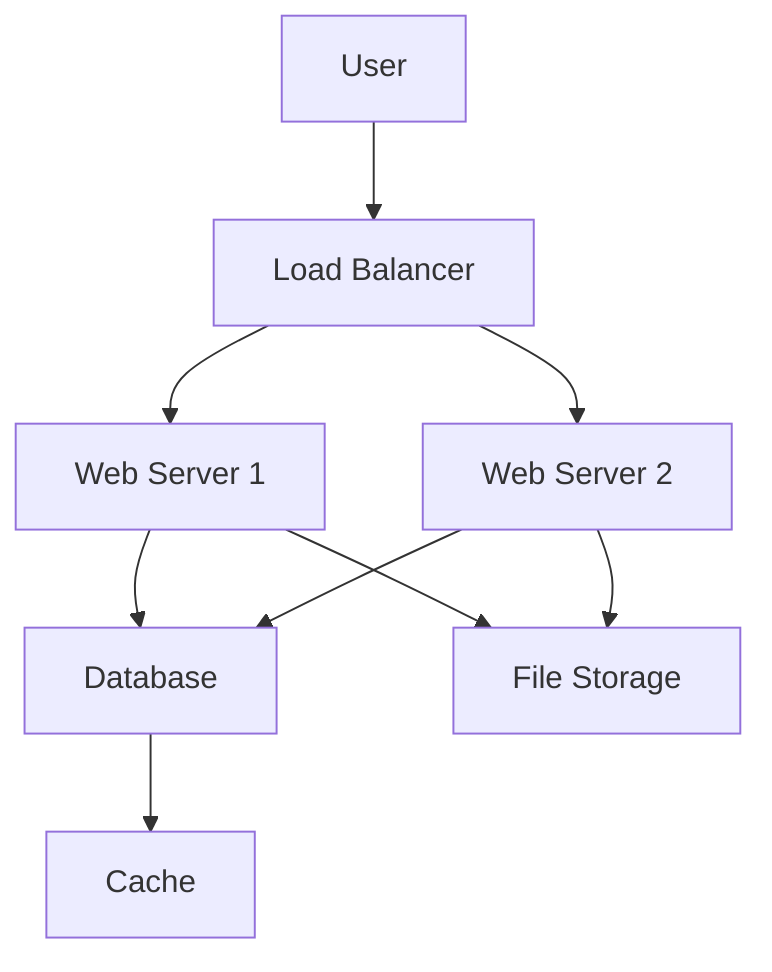
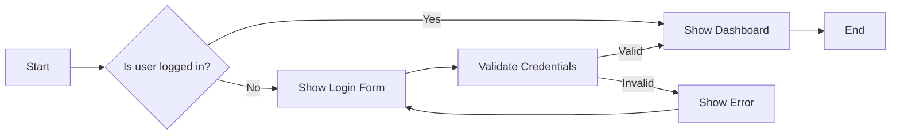

# Enhanced Blog Features

This post demonstrates the enhanced blog functionality including **code blocks**, **mathematical equations**, **interactive charts**, and **diagrams**.

## Code Blocks with Syntax Highlighting

Here's a JavaScript function with syntax highlighting:

```javascript
// Binary search implementation
function binarySearch(arr, target) {
    let left = 0;
    let right = arr.length - 1;
    
    while (left <= right) {
        const mid = Math.floor((left + right) / 2);
        
        if (arr[mid] === target) {
            return mid;
        } else if (arr[mid] < target) {
            left = mid + 1;
        } else {
            right = mid - 1;
        }
    }
    
    return -1; // Not found
}

// Example usage
const numbers = [1, 2, 3, 4, 5, 6, 7, 8, 9, 10];
const result = binarySearch(numbers, 7);
console.log(`Found at index: ${result}`); // Found at index: 6

```

Python example with data analysis:

```python
import pandas as pd
import numpy as np
from sklearn.model_selection import train_test_split
from sklearn.linear_model import LinearRegression

# Load and prepare data
def prepare_data(file_path):
    """Load and clean dataset for machine learning."""
    df = pd.read_csv(file_path)
    
    # Handle missing values
    df = df.dropna()
    
    # Feature engineering
    df['feature_ratio'] = df['feature_1'] / df['feature_2']
    
    return df

# Train model
def train_model(X, y):
    """Train a linear regression model."""
    X_train, X_test, y_train, y_test = train_test_split(
        X, y, test_size=0.2, random_state=42
    )
    
    model = LinearRegression()
    model.fit(X_train, y_train)
    
    score = model.score(X_test, y_test)
    print(f"Model R² Score: {score:.4f}")
    
    return model

```

## Mathematical Equations

Inline math: The quadratic formula is $x = \frac{-b \pm \sqrt{b^2 - 4ac}}{2a}$.

Block equations:

$$
E = mc^2
$$

Complex mathematical expressions:

$$
\frac{d}{dx}\left( \int_{a}^{x} f(t) dt\right) = f(x)
$$

$$
\sum_{n=1}^{\infty} \frac{1}{n^2} = \frac{\pi^2}{6}
$$

## Data Visualizations

### Line Chart Example

```chart
{
  "type": "line",
  "title": "Website Traffic Growth",
  "description": "Monthly website visitors over the past year",
  "data": {
    "labels": ["Jan", "Feb", "Mar", "Apr", "May", "Jun", "Jul", "Aug", "Sep", "Oct", "Nov", "Dec"],
    "datasets": [{
      "label": "Visitors",
      "data": [1200, 1400, 1800, 2100, 2500, 2800, 3200, 3600, 3900, 4200, 4500, 4800],
      "borderColor": "rgb(99, 102, 241)",
      "backgroundColor": "rgba(99, 102, 241, 0.1)",
      "fill": true
    }]
  }
}

```

### Bar Chart Example

```chart
{
  "type": "bar",
  "title": "Programming Language Popularity",
  "description": "Survey results from 1000 developers",
  "data": {
    "labels": ["JavaScript", "Python", "Java", "TypeScript", "C#", "Go"],
    "datasets": [{
      "label": "Developers",
      "data": [650, 580, 420, 380, 350, 180],
      "backgroundColor": [
        "rgba(255, 99, 132, 0.8)",
        "rgba(54, 162, 235, 0.8)",
        "rgba(255, 205, 86, 0.8)",
        "rgba(75, 192, 192, 0.8)",
        "rgba(153, 102, 255, 0.8)",
        "rgba(255, 159, 64, 0.8)"
      ]
    }]
  }
}

```

## Diagrams and Flowcharts

### System Architecture Diagram



### Process Flow



## Enhanced Formatting

### Tables

| Feature | Basic | Premium | Enterprise |
|---------|-------|---------|------------|
| Users | 5 | 50 | Unlimited |
| Storage | 1GB | 100GB | 1TB |
| Support | Email | Priority | 24/7 Phone |
| Price | Free | $19/mo | $99/mo |

### Blockquotes

> "The best way to predict the future is to implement it."
> — Programming Wisdom

### Lists and Emphasis

**Key Features:**
- ✅ **Syntax highlighting** for 150+ languages
- ✅ **Mathematical equations** with MathJax
- ✅ **Interactive charts** with Chart.js
- ✅ **Diagrams** with Mermaid
- ✅ **Copy-to-clipboard** functionality
- ✅ **Responsive design** for all devices

*Advanced capabilities:*
1. Real-time equation rendering
2. Customizable chart themes
3. Export diagrams as SVG
4. Accessible markup
5. SEO-optimized content

## Conclusion

These enhanced blog features provide a comprehensive platform for technical writing, data visualization, and educational content. Perfect for documenting **cybersecurity research**, **penetration testing methodologies**, and **certification study notes**.

---

**Next Steps:**
- Explore the interactive features
- Try creating your own mathematical content
- Experiment with different chart types
- Build complex system diagrams
